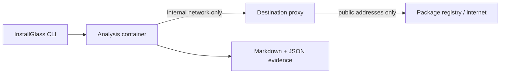

<div align="center">

# InstallGlass

**See what an npm install tried to do before you trust it on your machine.**

[](https://github.com/RepoEnjoyer/InstallGlass/actions/workflows/ci.yml)
[](LICENSE)
[](package.json)

</div>

InstallGlass runs an npm package installation inside a disposable, resource-limited Docker container. It traces filesystem and process activity, forces network traffic through a destination-logging proxy, observes Node.js environment-variable access, inventories native artifacts, and writes a reviewable Markdown report plus optional JSON.

It never forwards your npm configuration or host credentials into the sandbox.

## Why this exists

`npm install` can execute package lifecycle scripts. Those scripts can start processes, download binaries, inspect the environment, and read files with the installing user's permissions. `npm --ignore-scripts` is useful, but it does not show what the scripts would have attempted.

InstallGlass gives those scripts a deliberately empty, instrumented environment instead.

## What it records

| Evidence | Collection method | Privacy boundary |
| --- | --- | --- |
| Files read, created, changed, renamed, or deleted | `strace` file syscalls | Sandbox paths are normalized; host paths are not reported |
| npm lifecycle scripts | Foreground npm lifecycle diagnostics | Commands are bounded and credential patterns are redacted |
| Child processes | Node preload instrumentation | High-entropy and credential-like arguments are redacted |
| Network destinations | Dedicated HTTP/CONNECT proxy | Hostname, port, method, block result; no bodies, headers, or query strings |
| Environment access | Proxy around `process.env` | Variable names and operations only; never values |
| Native artifacts | Magic bytes, executable mode, and SHA-256 | Installed artifact metadata only |
| Static signals | Small deterministic heuristic set | Rule, path, line, and fingerprint; no source snippets |

## Security model



The analysis container runs as your numeric user, with a read-only root filesystem, all Linux capabilities dropped, `no-new-privileges`, process/CPU/memory limits, a no-exec temporary filesystem, and only disposable analysis/output directories mounted. It has no direct route to the internet. The proxy rejects private, loopback, link-local, reserved, and mixed public/private DNS results.

This is defense in depth, not a VM or a safety certificate. Read [the threat model](docs/THREAT_MODEL.md) before using InstallGlass with deliberately hostile packages.

## Requirements

- Linux, macOS, or Windows with [Docker Engine or Docker Desktop](https://docs.docker.com/get-docker/) running
- Node.js 20 or newer
- Enough space to build the small local sandbox image on first use

The syscall collector currently requires a Linux Docker container. Docker Desktop provides the required Linux VM on macOS and Windows.

## Install

Install directly from GitHub:

```bash
npm install --global github:RepoEnjoyer/InstallGlass
installglass doctor
```

Or build from source:

```bash
git clone https://github.com/RepoEnjoyer/InstallGlass.git
cd InstallGlass
npm ci
npm run build
npm link
installglass doctor
```

The project has zero runtime npm dependencies. Development dependencies are locked in `package-lock.json` and repository lifecycle scripts are disabled by `.npmrc` during dependency installation.

## Quick start

Audit an exact package version:

```bash
installglass audit package-name@1.2.3 --json package-audit.json
```

Audit a local package without placing its host path in the report:

```bash
installglass audit ./path-to-package --output local-audit.md
```

Fail CI if a finding meets a threshold:

```bash
installglass audit package-name@1.2.3 --fail-on high
```

Exit codes are `0` for a collected report, `1` for an InstallGlass failure, and `3` when `--fail-on` is reached. An npm install failure is reported as an incomplete run rather than silently discarded.

## Demo

```text
$ installglass audit package-name@1.2.3 --json audit.json
Auditing package-name@1.2.3…
Report written. Verdict: review-recommended; observed-risk score: 28/100.
```

The Markdown report starts with findings and then shows the underlying evidence:

```text
# InstallGlass audit report

> Review recommended · 28/100 observed-risk score

## Network destinations
| Destination | Method | Blocked | Count | Reason |
| registry.npmjs.org:443 | CONNECT | No | 4 | — |
```

No fake package verdicts are built in: scores are deterministic summaries of observed evidence, and every finding links back to report evidence.

## CLI

```text
installglass audit <package-spec> [options]

  -o, --output <path>       Markdown report (default: installglass-report.md)
      --json <path>         Also write the complete JSON evidence report
      --timeout <duration>  1s to 30m (default: 2m)
      --memory <limit>      Docker memory limit (default: 768m)
      --cpus <count>        Docker CPU limit (default: 1.5)
      --pids-limit <count>  Process limit (default: 256)
      --docker-command <c>  Docker-compatible command (default: docker)
      --rebuild             Rebuild the sandbox image
      --keep-workspace      Retain temporary evidence for local debugging
      --fail-on <severity>  low, medium, high, or critical
```

Registry package names, versions, tags, aliases, tarball URLs, and local directories/tarballs accepted by `npm install` are supported. Private registries and authenticated packages are intentionally not supported in v1 because forwarding credentials would weaken the central safety guarantee.

## Configuration

InstallGlass is configured entirely with CLI flags. It does not read a project `.env`, host `.npmrc`, Docker config, Git config, cloud credential directory, or shell profile. There are no required API keys.

The sandbox uses the public npm registry configured in its clean environment. Network destinations requested by package code are allowed only when they resolve entirely to public addresses.

## Interpreting results

- **Low observed risk** means this run did not produce stronger signals. It does not mean “safe.”
- **Review recommended** means behavior deserves source or maintainer review.
- **High-risk behavior observed** means multiple serious signals or a critical signal plus other evidence were seen.
- **Incomplete** means the installation or evidence collection did not finish.

Expected packages can legitimately compile native modules, launch a shell, or download a platform binary. Context matters. A runtime read of a decoy credential path is much stronger evidence than a static string mentioning `.npmrc`.

## Troubleshooting

**Docker is installed but unavailable**  
Run `installglass doctor`, start Docker Desktop or the Docker daemon, and confirm your user can run `docker version`.

**The first audit is slow**  
InstallGlass builds `installglass/sandbox:1.0.0` locally on first use. Later audits reuse it; pass `--rebuild` after upgrading InstallGlass.

**Install timed out or ran out of memory**  
Use `--timeout 5m` or `--memory 2g`. Keep the limits as small as the target package reasonably needs.

**A private package cannot be installed**  
That is an intentional v1 limitation. Do not work around it by embedding a token in the package URL; URLs can be exposed to package tooling and process listings.

**No syscall evidence appears**  
Check the report's collection warnings. Some hardened or rootless Docker configurations may restrict tracing. Open an issue with Docker version, OS family, and the warning—never attach credentials or a report containing data you have not reviewed.

See [report format](docs/REPORT_FORMAT.md), [architecture](docs/ARCHITECTURE.md), and [development guide](CONTRIBUTING.md) for more.

## Project status

Version 1.0.0 focuses on npm and Linux-container analysis. See the [roadmap](ROADMAP.md) for planned diffing, policy files, provenance checks, and additional package managers.

## Contributing and security

Contributions are welcome. Read [CONTRIBUTING.md](CONTRIBUTING.md), [SECURITY.md](SECURITY.md), and [AI_HANDOFF.md](AI_HANDOFF.md). Please report vulnerabilities privately rather than opening a public exploit issue.

## License

MIT © RepoEnjoyer. See [LICENSE](LICENSE).
